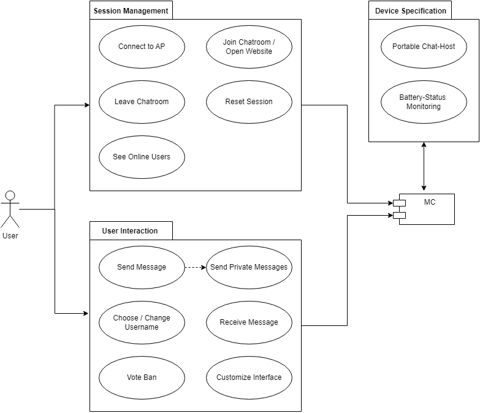

# MC-Messenger - Software Requirements Specification 

## Table of contents
- [Table of contents](#table-of-contents)
- [Introduction](#1-introduction)
    - [Purpose](#11-purpose)
    - [Scope](#12-scope)
    - [Definitions, Acronyms and Abbreviations](#13-definitions-acronyms-and-abbreviations)
    - [References](#14-references)
    - [Overview](#15-overview)
- [Overall Description](#2-overall-description)
    - [Vision](#21-vision)
    - [Use Case Diagram](#22-use-case-diagram)
	- [Technology Stack](#23-technology-stack)
- [Specific Requirements](#3-specific-requirements)
    - [Functionality](#31-functionality)
- [Supporting Information](#4-supporting-information)

## 1. Introduction

### 1.1 Purpose
This Software Requirements Specification (SRS) document describes all requirements specifications for our Project "MC-Messenger". 
It includes an overview about this project, its vision, requirements and their specific use-cases. 

### 1.2 Scope (Erik G)
xxx

### 1.3 Definitions, Acronyms and Abbreviations (Erik S)
| Abbrevation | Explanation                            |
| ----------- | -------------------------------------- |
| AP          | Access Point (Wifi)                    |
| MC          | MicroController                        |
| SRS         | Software Requirements Specification    |
| tbd         | to be decided                          |
| UC          | Use Case                               |

### 1.4 References

| Title                                                              | Date       | Publishing organization   |
| -------------------------------------------------------------------|:----------:| ------------------------- |
| [WordPress Blog](https://semcmessenger.wordpress.com)              | 06.10.2022 | MC-Messenger Team         | 
| [GitHub](https://github.com/Scherrik/se_mcm)                       | 06.10.2022 | MC-Messenger Team         |

### 1.5 Overview
THehe following chapter gives an overview of this project with its vision and the Use Case Diagram. The third chapter (Specific Requirements) gives more details about the specific requirements in terms of functionality, (and later) usability and design parameters. The last chapter provides support information. 
    
## 2. Overall Description

### 2.1 Vision
Humans have the need to communicate. Today most of the communication is done via messenging services on the internet. If we can’t directly communicate verbaly we heavily dependent on good and fast internet services.
But: We also find ourselfes in environments where we are not allowed to speak or the situation makes it very difficult to communciate in private (e.g. school, university, library, industrial fairs, plane/train/bus, disco, loud bar).
In these situations communication gets impossible if there is no stable internet connection.
We want to provide an from the internet infrastructure independent and fast local bound Messenger-Service.

Our goal is to implement this vison with a browser accessible webserver and the help of a microcontroller.
This allows a portable and in almost every environment implementable chat server for everyone at that specific location. The users can use any device they want, it only needs a wifi connectibiliy and a browser. We want to provide a broadcast and private chat and the possibility for the user to select a custom username.

### 2.2 Use Case Diagram

### 2.3 Technology Stack

#### Backend:
- Hardware: ESP32 (ESP32 Wi-Fi & Bluetooth MCU I Espressif Systems)
- µC development: Arduino IDE with ESP SDK, Language: C++ Dialect (Arduino)

#### Frontend:
- HTML
- CSS
- JS

#### IDE:
- VisualStudio

#### Project Management:
- Jira
- GitHub
- Discord
- WordPress

#### Deployment:
- Web Browser

#### Testing:
- tbd

## 3. Specific Requirements

### 3.1 Functionality
This section will explain the different use cases, you could see in the Use Case Diagram, and their functionality.  

#### 3.1.1 Connect to AP
This function is fundamental for the user to use the application. The user needs to connect to the wifi network without having a technical background or special skills. This should happen as automatically as possible. For mobile phones a QR-Code will be provided which can be scanned to add the wifi to the users phone. As an alternative the user needs to select the wifi manually. The wifi can be configures to be private (with password) or public depending of the purpose and location.
##### Postcondition
- Join Chatroom/Open Website
##### Story points: 1

[Connect to AP TEMP:(Pfad zum MockupBild in Git- screenshot QR code/windows wifi window?)](./use_cases/temp1.md)

#### 3.1.2 Join Chatroom/Open Website
After connecting to the wifi the user needs to be guided to the Webpage of the Messenger. This can happen automatically on mobile devices. On Laptops or other devices the user may need to open the pange manually. A short and easy to remember url needs to be individually configured on the MC. 
##### Precondition:
- Connect to AP
##### Story points: 1

[TEMP: Link zum Mockup oder direkt einfügen](./use_cases/temp1.md)

#### 3.1.3 Leave Chatroom
The user can leave/close a specific chat chatroom by pressing the (X) Button on the top right of the chhat window or closing the browser window.
##### Precondition:
- Join Chatroom/Open Website
##### Story points
1

[TEMP: Link zum Mockup oder direkt einfügen](./use_cases/temp1.md)

#### 3.1.4 Reset Session
THe user will be able to reset his session with a dedicated button or by reloading the page. Resetting means all the chats will be reloaded and the local chatlog will be cleared
##### Precondition:
- Join Chatroom/Open Website
##### Story points: 1

[TEMP: Link zum Mockup oder direkt einfügen](./use_cases/temp1.md)

#### 3.1.5 See Online Users
On the left side of the screen the user can see a list of all the currently online users and their usernames. The list can be minimized with a button.
##### Precondition:
- Join Chatroom/Open Website
##### Story points: 3

[TEMP: Link zum Mockup oder direkt einfügen](./use_cases/temp1.md)

#### 3.1.6 Send Message
After opening the page and selecting a username the user joins the public chat automatically. The User can type a message in a text box on the buttom and send the message with the "Send" button next or below the chat box.
##### Precondition:
- Join Chatroom/Open Website
- Choose/Change Username
##### Postcondition:
Send private Message
##### Story points: 5

[TEMP: Link zum Mockup oder direkt einfügen](./use_cases/temp1.md)

#### 3.1.7 Send private Message
The user can also send private messages by selecting an online user in the described list on the left. A new chat opens on the right side. The window can also be opened in a seperate Browser Tab. The user can jump between chats by selecting a user or global chat on the left.
##### Precondition: 
- Join Chatroom/Open Website
- Choose/Change Username
- Send Message
- See Online Users
##### Story points: 5

[TEMP: Link zum Mockup oder direkt einfügen](./use_cases/temp1.md)

#### 3.1.8 Receive Message
The user can receive messages which are displayed in the correct chatroom. The username of the sending user and a time stamp will be shown next to the message. A chatroom ( the list on the left side of the screen) which has unread messages will will be marked with a colored marking.
##### Precondition:
- Join Chatroom/Open Website
- Choose/Change Username
- See Online Users
##### Story points: 6

[TEMP: Link zum Mockup oder direkt einfügen](./use_cases/temp1.md)

#### 3.1.9 Choose/Change Username
DESCRIPTION
##### Precondition:
Join Chatroom/Open Website
##### Postcondition
##### Effort estimation / story points

[TEMP: Link zum Mockup oder direkt einfügen](./use_cases/temp1.md)

#### 3.1.10 Vote Ban 
DESCRIPTION
##### Precondition:
Join Chatroom/Open Website
##### Postcondition
##### Effort estimation / story points

[TEMP: Link zum Mockup oder direkt einfügen](./use_cases/temp1.md)

#### 3.1.11 Customize Interface
DESCRIPTION
##### Precondition:
Join Chatroom/Open Website
##### Postcondition
##### Effort estimation / story points

[TEMP: Link zum Mockup oder direkt einfügen](./use_cases/temp1.md)

#### 3.1.12 Portable Chat-Host
DESCRIPTION
##### Precondition:
##### Postcondition
##### Effort estimation / story points

[TEMP: Link zum Mockup oder direkt einfügen](./use_cases/temp1.md)

#### 3.1.13 Battery-Status Monitoring
DESCRIPTION
##### Precondition:
##### Postcondition
##### Effort estimation / story points

[TEMP: Link zum Mockup oder direkt einfügen](./use_cases/temp1.md)

## 4. Supporting Information
For any further information you can contact the MC-Messenger Team or check our [Blog](https://semcmessenger.wordpress.com). 
The Team Members are:
- Marcel Fischer
- Erik Günther
- Erik Schneider
- Tim Nau

<!-- Picture-Link definitions: -->
[OUCD]: https://github.com/IB-KA/CommonPlayground/blob/master/UseCaseDiagramCP.png "Overall Use Case Diagram"
