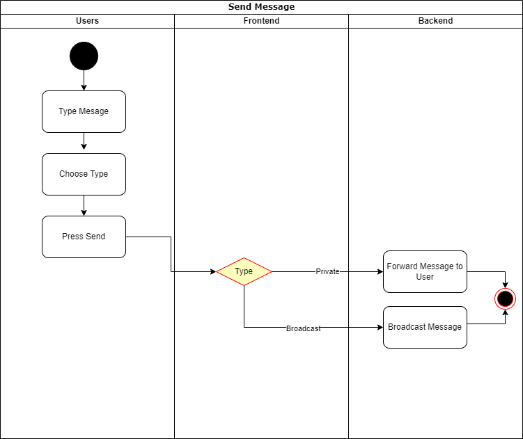
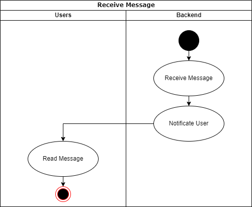
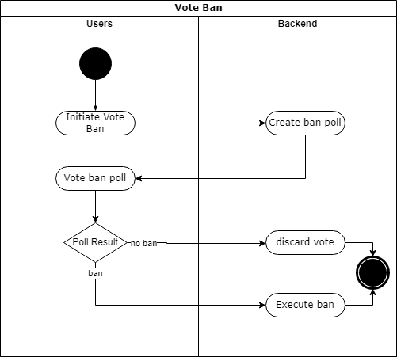

# MC-Messenger - Software Requirements Specification 

## Table of contents
- [Table of contents](#table-of-contents)
- [Introduction](#1-introduction)
    - [Purpose](#11-purpose)
    - [Scope](#12-scope)
    - [Definitions, Acronyms and Abbreviations](#13-definitions-acronyms-and-abbreviations)
    - [References](#14-references)
    - [Overview](#15-overview)
- [Overall Description](#2-overall-description)
    - [Vision](#21-vision)
    - [Use Case Diagram](#22-use-case-diagram)
	- [Technology Stack](#23-technology-stack)
- [Specific Requirements](#3-specific-requirements)
    - [Functionality](#31-functionality)
    - [Usability](#32-usability)
    - [Reliability](#33-reliability)
    - [Performance](#34-performance)
    - [Supportability](#35-supportability)
    - [Design Constraints](#36-design-constraints)
    - [Online User Documentation and Help System Requirements](#37-on-line-user-documentation-and-help-system-requirements)
    - [Purchased Components](#38-purchased-components)
    - [Interfaces](#39-interfaces)
    - [Licensing Requirements](#310-licensing-requirements)
    - [Legal, Copyright And Other Notices](#311-legal-copyright-and-other-notices)
    - [Applicable Standards](#312-applicable-standards)
- [Supporting Information](#4-supporting-information)

## 1. Introduction

### 1.1 Purpose
This Software Requirements Specification (SRS) document describes all requirements specifications for our Project "MC-Messenger". 
It includes an overview about this project, its vision, requirements and their specific use-cases. 

### 1.2 Scope

The main goal of this project is to connect people in the nearby environment on-the-fly and in a non-binding context. Everybody should be able to easily connect and be part of the Mc_Messenger community without a complicated registration process.

The project is split into two main paths, frontend and backend development. State-of-the-art web technologies like html and javascript are used in the frontend in contrast to the backend where c++ is used.

#### Planned services provided by the application are:

* Exchange (text) messages:
	Of course it's the essential part for a messenger project.
* Provide a list of chat participants for each user
* Set own username on-the-fly
* Get information about the health status of the µC

### 1.3 Definitions, Acronyms and Abbreviations
| Abbrevation | Explanation                            |
| ----------- | -------------------------------------- |
| AP          | Access Point (Wifi)                    |
| MC          | MicroController                        |
| SRS         | Software Requirements Specification    |
| tbd         | to be decided                          |
| UC          | Use Case                               |

### 1.4 References

| Title                                                              | Date       | Publishing organization   |
| -------------------------------------------------------------------|:----------:| ------------------------- |
| [WordPress Blog](https://semcmessenger.wordpress.com)              | 06.10.2022 | MC-Messenger Team         | 
| [GitHub](https://github.com/Scherrik/se_mcm)                       | 06.10.2022 | MC-Messenger Team         |

### 1.5 Overview
THehe following chapter gives an overview of this project with its vision and the Use Case Diagram. The third chapter (Specific Requirements) gives more details about the specific requirements in terms of functionality, (and later) usability and design parameters. The last chapter provides support information. 
    
## 2. Overall Description

### 2.1 Vision
Humans have the need to communicate. Today most of the communication is done via messenging services on the internet. If we can’t directly communicate verbaly we heavily dependent on good and fast internet services.
But: We also find ourselfes in environments where we are not allowed to speak or the situation makes it very difficult to communciate in private (e.g. school, university, library, industrial fairs, plane/train/bus, disco, loud bar).
In these situations communication gets impossible if there is no stable internet connection.
We want to provide an from the internet infrastructure independent and fast local bound Messenger-Service.

Our goal is to implement this vison with a browser accessible webserver and the help of a microcontroller.
This allows a portable and in almost every environment implementable chat server for everyone at that specific location. The users can use any device they want, it only needs a wifi connectibiliy and a browser. We want to provide a broadcast and private chat and the possibility for the user to select a custom username.

### 2.2 Use Case Diagram

### 2.3 Technology Stack

#### Backend:
- Hardware: ESP32 (ESP32 Wi-Fi & Bluetooth MCU I Espressif Systems)
- µC development: Arduino IDE with ESP SDK, Language: C++ Dialect (Arduino)

#### Frontend:
- HTML
- CSS
- JS

#### IDE:
- VisualStudio

#### Project Management:
- Jira
- GitHub
- Discord
- WordPress

#### Deployment:
- Web Browser

#### Testing:
- tbd

## 3. Specific Requirements

### 3.1 Functionality
This section will explain the different use cases, you could see in the Use Case Diagram, and their functionality.  

#### 3.1.1 Connect to AP
This function is fundamental for the user to use the application. The user needs to connect to the wifi network without having a technical background or special skills. This should happen as automatically as possible. For mobile phones a QR-Code will be provided which can be scanned to add the wifi to the users phone. As an alternative the user needs to select the wifi manually. The wifi can be configured to be private (with password) or public depending of the purpose and location.
##### Postcondition
- Join chatroom/Open website
##### Postcondition
/
##### Story points: 1

[Mockup: Connect to AP](./UseCases/mockups/Connect_to_AP_MOC.png)

#### 3.1.2 Join chatroom/Open website
After connecting to the wifi the user needs to be guided to the webpage of the messenger. This can happen automatically on mobile devices. On laptops or other devices the user may need to open the pange manually. A short and easy to remember url needs to be individually configured on the MC. 
##### Precondition:
- Connect to AP
#### Postcondition:
- Choose/Change username
##### Story points: 1

[Mockup: Join chatroom/Open Website](./UseCases/mockups/Open_Website_MOC.png)

#### 3.1.3 Leave chatroom
The user can leave/close a specific chat chatroom by pressing the (X) Button on the top right of the chat window or by closing the browser window.
##### Precondition:
- Join chatroom/Open website
##### Postcondition
/
##### Story points: 1

[Mockup: Leave chatroom](./UseCases/mockups/Leave_chatroom_MOC.png)

#### 3.1.4 Choose/Change username
After opening the application page the user needs to select a username which will be displayed to other users. The user can also change his username during the session. A carefull evaluation to avoid abuse of this feature may be needed.
##### Precondition:
- Join chatroom/Open website
##### Postcondition
/
##### Story points: 2

[Mockup: Choose/Change username](./UseCases/mockups/See_Users_MOC.png)

#### 3.1.5 Reset session
THe user will be able to reset his session with a dedicated button or by reloading the page. Resetting means all the chats will be reloaded and the local chatlog will be cleared
##### Precondition:
- Join chatroom/Open website
##### Postcondition
/
##### Story points: 1

[No Mockup available yet]

#### 3.1.6 See online users
On the top (or costumizable on the left) of the screen the user can see a list of all the currently online users and their usernames. The list can be minimized with a button.
##### Precondition:
- Join chatroom/Open website
##### Postcondition
/
##### Story points: 3

[Mockup: See online users](./UseCases/mockups/See_Users_MOC.png)

#### 3.1.7 Send message
After opening the page and selecting a username the user joins the public chat automatically. The User can type a message in a text box on the buttom and send the message with the "Send" button next or below the chat box. The sender gets his message displayed with a @you in front of it.
##### Precondition:
- Join chatroom/Open website
- Choose/Change username
##### Postcondition:
Send private message
##### Story points: 5

[Mockup: Send message](./UseCases/mockups/Send_MOC.png)
##### Activity Diagram:

#### 3.1.8 Send private message
The user can also send private messages by selecting an online user in the described list. A new chat opens on the right side. The window can also be opened in a seperate browser tab. The user can jump between chats by selecting a user or global chat on the left.
##### Precondition: 
- Join chatroom/Open website
- Choose/Change username
- Send message
- See online users
##### Postcondition
/
##### Story points: 5

[Mockup: Send private message](./UseCases/mockups/Send_Private_Message_MOC.png)

#### 3.1.9 Receive message
The user can receive messages which are displayed in the correct chatroom. The username of the sending user and a time stamp will be shown next to the message. A chatroom (the list next to the chat window) which has unread messages will be marked with a colored marking.
##### Precondition:
- Join chatroom/Open website
- Choose/Change username
- See online users
##### Story points: 6
##### Activity Diagram:

[Mockup: Receive message](./UseCases/mockups/Receive_Messages_MOC.png)

#### 3.1.10 Vote ban 
In case of bad behaviour users have the ability to vote ban a misbehaving user. The user can rightclick a name and select "vote to ban". Other users in tis chatroom get a notification and can vote between "yes" and "no".
##### Precondition:
- Join chatroom/Open website
##### Postcondition
/
##### Story points: 3

[No mockup available yet]

##### Activity Diagram:

#### 3.1.11 Customize interface
The user gets the ability to customize his user interface. They can select different modes and colors under the settings tab. The settings can be accessed with the gear button on the top right.  
##### Precondition:
- Join chatroom/Open website
- Select username
##### Postcondition
/
##### Story points: 2

[No Mockup available yet]

#### 3.1.12 Portable chat-host
The deliver the independent portable feature the entire services will run on a MicroController (MC). The MC is equipt with a strong portable battery. This battery needs to be monitored and charged regularly.
##### Precondition:
/
##### Postcondition
- Battery-status monitoring
##### Story points: 2

#### 3.1.13 Battery-status monitoring
This is an administration use case. The battery needs to be monitored. There are many options available. A seperat admin gui with password security or information emails in regular intervalls would be possible. A solution is tbd.
##### Precondition:
Portable chat-host
##### Postcondition
/
##### Story points: 3

[No mockup available yet]

### 3.2 Usability
The application is planned to be user friendly and as intuitive as possible. There should not be any additional user documentation needed.

#### 3.2.1 Easy to navigate
The app should be easy to navigate and similar to common designs of messengers. The GUI should be intuitiva and not cause any frustration.

### 3.3 Reliability
Reliability is very important requirement for this app. Battery runtime and connection stability are the important Refinements.

#### 3.3.1 Availability
The server of the messenger should be available 95% of the time. Planable downtime should be scheduled during times of low user numbers. Battery outage and connection overload needs to be handled accordingly.

#### 3.3.2 Defect Rate
At the moment no chat logs are planned. Only usernames would be lost in case of a defect because maessages are saved on the local browser of the user. A defect needs to be avoided but does not have a big inpact on the loss of data. 

### 3.4 Performance

#### 3.4.1 Response times
The latency of a message beeing send and received should be as low as possible by the network speed. If the latency gets to a high because to many messages are sent a "spam filter" or "slow mode" will be active to limit the amount of messages a user can send in a specific time frame.

#### 3.4.2 Amount of users
The amount of users should be very high. Currently the hardware of the mc is limiting this number below 10. This needs to be evaluated and can hopefully be solved.

#### 3.4.3 Storage 
Storage is limeted on the mc. Therefore only usernames and ids will be saved on the mc. Chats will only be saved o nthe currently receving clients.

### 3.5 Supportability

#### 3.5.1 Coding Standards
The code will be written after the most common clean code standards. Variables and methods are named after there function. This makes the code more readable and easier to understand. 

### 3.6 Design Constraints
Plain HTML, CSS and JS will be used which makes the code independent from special framworks or libraries.
The C++ code for the backend is specialised for the specific MC. If a change of the MC is made the code needs to be updated.

### 3.7 On-line User Documentation and Help System Requirements
The messenger is planned to be very intuitive. No user documentation is planned. A "report a bug" button may be implemented. 

### 3.8 Purchased Components
Microcontroller: ESP32

### 3.9 Interfaces

#### 3.9.1 User Interfaces
Following user interfaces will be implemented:
- Username selection
- Main GUI
- Poll window and settings to change colours and more
- List of connected usernames
- Chat window, text box to write global and private messages

#### 3.9.2 Hardware Interfaces
The application will run on a ESP32 (ESP32 Wi-Fi & Bluetooth MCU I Espressif Systems).

#### 3.9.3 Software Interfaces
The backend software will be written with Arduino IDE with ESP SDK (Language: C++ Dialect (Arduino))
THe frontend will be written with HTML, CSS and JS. This should be supported by every modern device.

#### 3.9.4 Communication Interfaces
The frontend and server will communicate via JSON files and HTTP protocol.

### 3.10 Licensing Requirements

### 3.11 Legal, Copyright, and Other Notices
na 
### 3.12 Applicable Standards
THe messenger will be implemented using clean code standard and naming conventions.

## 4. Supporting Information
For any further information you can contact the MC-Messenger Team or check our [Blog](https://semcmessenger.wordpress.com). 
The Team Members are:
- Marcel Fischer
- Erik Günther
- Erik Schneider
- Tim Nau
