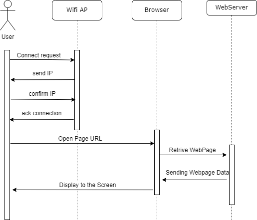

# How to connect to the Application - Use-Case-Realization Specification (UCRS) 

## Table of contents
- [Table of contents](#table-of-contents)
- [Introduction](#1-introduction)
    - [Purpose](#11-purpose)
    - [Scope](#12-scope)
    - [Definitions, Acronyms and Abbreviations](#13-definitions-acronyms-and-abbreviations)
    - [References](#14-references)
    - [Overview](#15-overview)
- [Flows of Events](#2-flows-of-events)
- [Supporting Information](#3-supporting-information)

## 1. Introduction

### 1.1 Purpose
This Use-Case-Realization Specification (UCRS) document describes how a specific function of the application will work.
It includes an overview about the feature and a sequence diagram to visualize the flow of events. 

### 1.2 Scope

 This document shows how the connection to the AP and the opening of the application website will work.

### 1.3 Definitions, Acronyms and Abbreviations
| Abbrevation | Explanation                            |
| ----------- | -------------------------------------- |
| AP          | Access Point (Wifi)                    |
| MC          | MicroController                        |
| tbd         | to be decided                          |
| UC          | Use Case                               |

### 1.4 References

| Title                                                              | Date       | Publishing organization   |
| -------------------------------------------------------------------|:----------:| ------------------------- |
| [WordPress Blog](https://semcmessenger.wordpress.com)              | 06.10.2022 | MC-Messenger Team         | 
| [GitHub](https://github.com/Scherrik/se_mcm)                       | 06.10.2022 | MC-Messenger Team         |

### 1.5 Overview
Thehe following chapter shows the flow of events for this specific feature in the form of a sequence diagram.
    
## 2. Flows of Events

## 3. Supporting Information
For any further information you can contact the MC-Messenger Team or check our [Blog](https://semcmessenger.wordpress.com). 
The Team Members are:
- Marcel Fischer
- Erik Günther
- Erik Schneider
- Tim Nau
