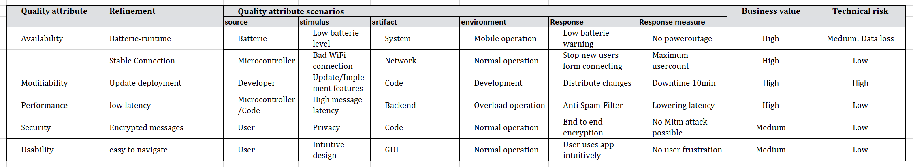
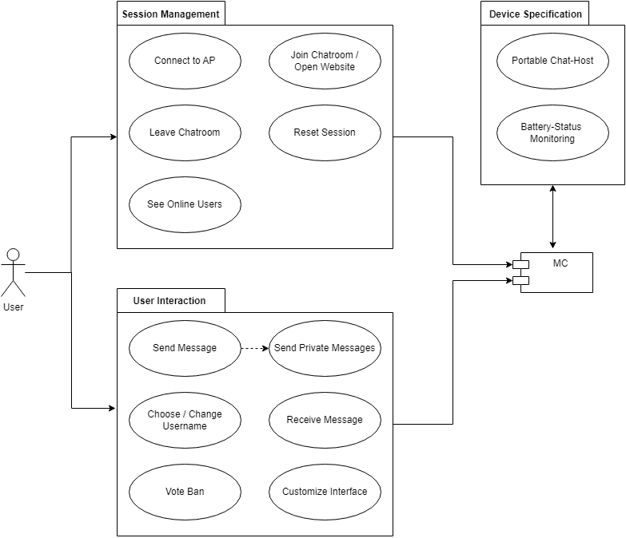
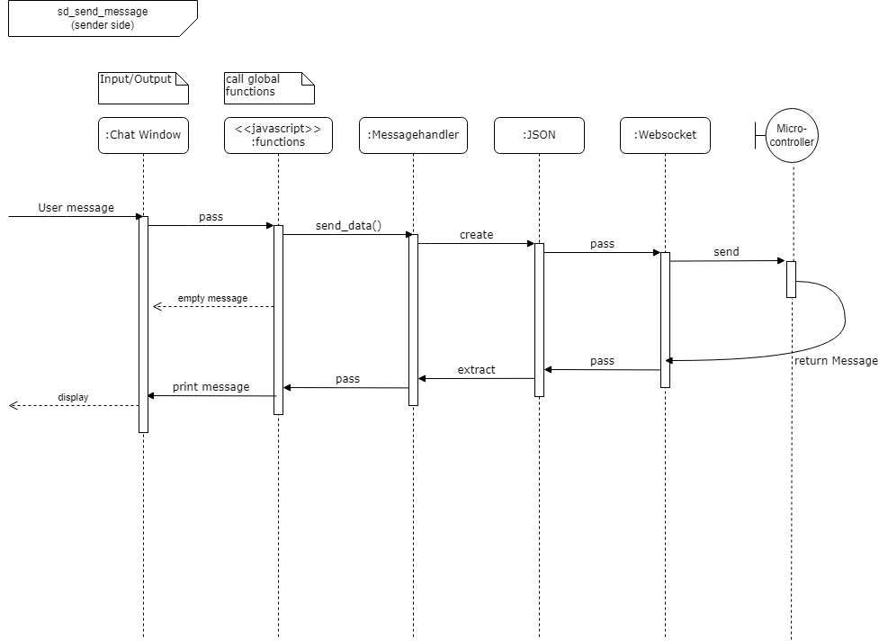
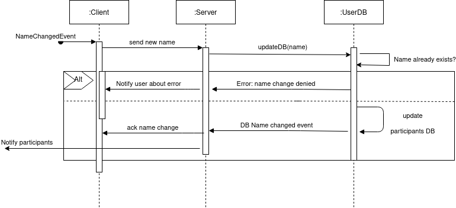
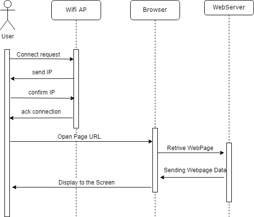
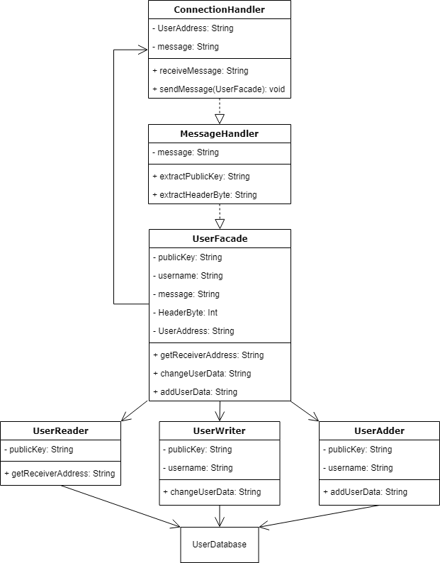
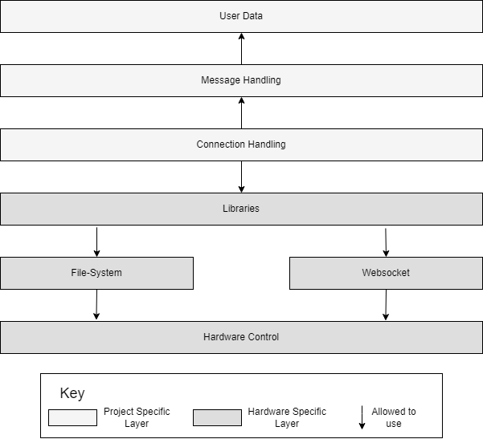

# MC-Messenger

# Software Architecture Document

Version 1.0

## Table of Contents

- [1. Introduction](#1-introduction)         
    - [1.1 Purpose](#11-purpose)     
    - [1.2 Scope](#12-scope)     
    - [1.3 Definitions, Acronyms and Abbreviations](#13-definitions-acronyms-and-abbreviations)     
    - [1.4 References](#14-references)     
    - [1.5 Overview](#15-overview)     
- [2. Architectural Representation](#2-architectural-representation)
- [3. Architectural Goals and Constraints](#3-architectural-goals-and-constraints)   
- [4. Use-Case View](#4-use-case-view)
    - [4.1 Use-Case Realizations](#41-use-case-realizations)     
- [5. Logical View](#5-logical-view)
    - [5.1 Overview](#51-overview)     
    - [5.2 Architecturally Significant Design Packages](#52-architecturally-significant-design-packages)     
- [6. Process View](#6-process-view)
- [7. Deployment View](#7-deployment-view)
- [8. Implementation View](#8-implementation-view)
- [8.1 Overview](#81-overview)     
- [8.2 Layers](#82-layers)     
- [9. Data View](#9-data-view)     
- [10. Size and Performance](#10-size-and-performance)               
- [11. Quality](#11-quality)               
- [12. Supporting Information](#12-supporting-information)

## 1. Introduction

### 1.1 Purpose

This Software Architecture document provides a architectural overview of the system. It is intended to show the different architectural decisions and documents architectural design choices.

### 1.2 Scope

The document shows and discusses the architectural design decisions of the software project "mc-messenger". It outlines what decisions have been made to support the architectural significant requirements 

### 1.3 Definitions, Acronyms and Abbreviations

| Abbrevation | Explanation                            |
| ----------- | -------------------------------------- |
| AP          | Access Point (Wifi)                    |
| ASR         | Architectural Significant Requirements |
| MC          | MicroController                        |
| SAD         | Software Architecture Document         |
| tbd         | to be decided                          |
| UC          | Use Case                               |

### 1.4 References

| Title                                                              | Date       | Publishing organization   |
| -------------------------------------------------------------------|:----------:| ------------------------- |
| [WordPress Blog](https://semcmessenger.wordpress.com)              | 06.10.2022 | MC-Messenger Team         | 
| [GitHub](https://github.com/Scherrik/se_mcm)                       | 06.10.2022 | MC-Messenger Team         |
| [ASR_Modifiability](./ArchitectureSignificantRequirements/Architecture-Design-and-Tactics.md) | 07.12.2022 | MC-Messenger Team |

### 1.5 Overview

This document summarizes the analysis and design discussions and decissions. It recaps back to the use-case analyzis and class design and concludes to the architecutural decisions which follow out of the ASR. 

## 2. Architectural Representation
<!--
This section describes what software architecture is for the current system, and how it is represented. Of the **Use-Case**, **Logical**, **Process**, **Deployment**, and **Implementation Views**, it enumerates the views that are necessary, and for each view, explains what types of model elements it contains.
-->
THe project will you a Layered architecture (open layers) :
Our software consists of several layers that need to be passed while sending and receiving a message or data. (Similar to the ISO/OSI model)
1. Frontend
2. Client-Backend: (scripts, js)
3. Backend
(and from 3. back to 1. when data is send from the server to a client)

It also is Event-driven: (mediator in form of backend)
Event: user input (message, namechange, colour, etc)
Server manages: flow, encapsulation of the header, check the database, forward to receivers

## 3. Architectural Goals and Constraints

<!-- 
This section describes the software requirements and objectives that have some significant impact on the architecture, for example, safety, security, privacy, use of an off-the-shelf product, portability, distribution, and reuse. It also captures the special constraints that may apply: design and implementation strategy, development tools, team structure, schedule, legacy code, and so on.
-->

In the following table/tree you can find our results of the discussion which requirements have a big impact on our architecture. Of all this requirements we picked modifiability to discuss further. You cand find the results in section 11.

[11. Quality](#11-quality)   

## 4. Use-Case View

<!--
This section lists use cases or scenarios from the use-case model if they represent some significant, central functionality of the final system, or if they have a large architectural coverage - they exercise many architectural elements, or if they stress or illustrate a specific, delicate point of the architecture.
-->

### 4.1 Use-Case Realizations

<!--
This section illustrates how the software actually works by giving a few selected use-case (or scenario) realizations, and explains how the various design model elements contribute to their functionality.
-->
### 4.1.1 Component Sequence Diagram: Send a message

<!---------------------------------------------------------------------------------------------------------------------------------------------------->

## 4.1.2 How to connect to the Application - Use-Case-Realization Specification (UCRS) 

### 1. Introduction

### 1.1 Purpose
This Use-Case-Realization Specification (UCRS) document describes how a specific function of the application will work.
It includes an overview about the feature and a sequence diagram to visualize the flow of events. 

### 1.2 Scope

 This document shows how change of username will be handled by the server and its subsystem UserDB.

### 1.3 Definitions, Acronyms and Abbreviations
| Abbrevation | Explanation                            |
| ----------- | -------------------------------------- |
| AP          | Access Point (Wifi)                    |
| MC          | MicroController                        |
| tbd         | to be decided                          |
| UC          | Use Case                               |

### 1.4 References

| Title                                                              | Date       | Publishing organization   |
| -------------------------------------------------------------------|:----------:| ------------------------- |
| [WordPress Blog](https://semcmessenger.wordpress.com)              | 06.10.2022 | MC-Messenger Team         | 
| [GitHub](https://github.com/Scherrik/se_mcm)                       | 06.10.2022 | MC-Messenger Team         |

### 1.5 Overview
Thehe following chapter shows the flow of events for this specific feature in the form of a sequence diagram.
    
### 2. Flows of Events

<!---------------------------------------------------------------------------------------------------------------------------------------------------->

## 4.1.2 How to connect to the Application - Use-Case-Realization Specification (UCRS) 

### 1. Introduction

### 1.1 Purpose
This Use-Case-Realization Specification (UCRS) document describes how a specific function of the application will work.
It includes an overview about the feature and a sequence diagram to visualize the flow of events. 

### 1.2 Scope

 This document shows how the connection to the AP and the opening of the application website will work.

### 1.3 Definitions, Acronyms and Abbreviations
| Abbrevation | Explanation                            |
| ----------- | -------------------------------------- |
| AP          | Access Point (Wifi)                    |
| MC          | MicroController                        |
| tbd         | to be decided                          |
| UC          | Use Case                               |

### 1.4 References

| Title                                                              | Date       | Publishing organization   |
| -------------------------------------------------------------------|:----------:| ------------------------- |
| [WordPress Blog](https://semcmessenger.wordpress.com)              | 06.10.2022 | MC-Messenger Team         | 
| [GitHub](https://github.com/Scherrik/se_mcm)                       | 06.10.2022 | MC-Messenger Team         |

### 1.5 Overview
Thehe following chapter shows the flow of events for this specific feature in the form of a sequence diagram.
    
### 2. Flows of Events

<!---------------------------------------------------------------------------------------------------------------------------------------------------->

## 5. Logical View
<!--
This section describes the architecturally significant parts of the design model, such as its decomposition into subsystems and packages. And for each significant package, its decomposition into classes and class utilities. You should introduce architecturally significant classes and describe their responsibilities, as well as a few very important relationships, operations, and attributes.
-->

### 5.1 Overview
<!--
This subsection describes the overall decomposition of the design model in terms of its package hierarchy and layers.
-->
The application follows a simple layered structure:

1. Frontend
2. Client-Backend: (scripts, js)
3. Backend

The focus on this capter will be the backend. It is the only part which uses components and classes.

### 5.2 Architecturally Significant Design Packages
<!--
For each significant package, include a subsection with its name, its brief description, and a diagram with all significant classes and packages contained within the package.

For each significant class in the package, include its name, brief description, and, optionally a description of some of its major responsibilities, operations and attributes.
-->

### 5.2.1 Frontend
The frontend only consists of Plan HTML, CSS. Classes will not be used. The frontend only displays the data to the user in a specific way.

### 5.2.2 Client-Backend
The Client-Backend simply packages a request in a Json file and sends it to the server. Received json files will be evaluated and given to the frontend to be displayed.

### 5.2.3 Backend

- The ConnectionHandler receives the message string and the ip address of the sending client.

- The MessageHandler is called. This class extracts the HeaderByte. This HeaderByte holds a flag. This flag defines if the message-string contains a text-message, a new user, a namechange etc. The function extractPublicKey extracts a public key from the message-string. This public key defines the recipient of the message. This can be the server, a public message to everyone or a private message to s specific user.

- The class UserFacade is called. This class delegates to the specific UserClasses depending of the HeaderByte information. Those following functions interact with the user database.

- The class UserReader is responsible for reading the UserAddress from the database with matches with the public key.

- The class UserWriter is called if the HeaderByte specifes a change of userdata. A function changeUserData is called which forwards the changes to the database.

- The class UserAdder adds a new User to the Database. This also depends on the HeaderByte information.
The functions in 4.2 and 4.3 decrypt the message-part of the frame with the private key of the server and process the information.

- The ConnectionHandler is called which sends the Message or the sends the updated user information with the function sendMessage to the clients.

## 6. Process View

<!--
This section describes the system's decomposition into lightweight processes (single threads of control) and heavyweight processes (groupings of lightweight processes). Organize the section by groups of processes that communicate or interact. Describe the main modes of communication between processes, such as message passing, interrupts, and rendezvous.
-->

We modeled the process of sending a message in the following sequenze diagram in a component level. 

## 7. Deployment View
<!--
This section describes one or more physical network (hardware) configurations on which the software is deployed and run. It is a view of the Deployment Model. At a minimum for each configuration it should indicate the physical nodes (computers, CPUs) that execute the software, and their interconnections (bus, LAN, point-to-point, and so on.) Also include a mapping of the processes of the **Process View** onto the physical nodes.
-->
na

## 8. Implementation View
<!--
This section describes the overall structure of the implementation model, the decomposition of the software into layers and subsystems in the implementation model, and any architecturally significant components.
-->

### 8.1 Overview
<!--
This subsection names and defines the various layers and their contents, the rules that govern the inclusion to a given layer, and the boundaries between layers. Include a component diagram that shows the relations between layers.
-->
The following package diagram shows the layered structure of our software on a package level. It is not final! It will be refactored and simplified in the future!

### 8.2 Layers
<!--
For each layer, include a subsection with its name, an enumeration of the subsystems located in the layer, and a component diagram.
-->
#### 8.2.1 User Data
#### 8.2.2 Message Handling
#### 8.2.3 Connection Handling
#### 8.2.4 Libraries
#### 8.2.5 Websocket
#### 8.2.6 Filesystem
#### 8.2.7 Hardware Control

## 9. Data View
<!--
A description of the persistent data storage perspective of the system. This section is optional if there is little or no persistent data, or the translation between the Design Model and the Data Model is trivial.
-->
The server will save the uesernames and the coresponding ids in a simple json file. NO major database is required.

## 10. Size and Performance
<!--
A description of the major dimensioning characteristics of the software that impact the architecture, as well as the target performance constraints.
-->
The architecture of the backend server is dependend of the capabilities and compatibilities of the microcontroller. The memory, ram size and network bandwith is also a limiting factor. All components of the software need to work in the limits of the haardware. If the software gets to complex it increases the latency of the messages and loweres the amount of users. 

## 11. Quality
<!--
A description of how the software architecture contributes to all capabilities (other than functionality) of the system: extensibility, reliability, portability, and so on. If these characteristics have special significance, for example safety, security or privacy implications, they should be clearly delineated.
-->

### 11.1 Tactics:
Our main goal and discussed tactics focuss on modifiability. 
We used the provided checklist and discussed how we need to implement certain features to achieve the desired goal. You can find the whole ASR document on github. 

[ASR_Modifiability](./ArchitectureSignificantRequirements/Architecture-Design-and-Tactics.md)

The rest of chapter 11 is this document also appended below:

#### 11.1.1 Data model:
The addition of encryption changes a part of the data model (primarly the database of the backend! The frontend while be mostly unaffected)

=> Data abstraction: database attributes (public key etc)

##### Theming of the GUI:
- Change of name, colour etc. by the user
- Change of web overlay theme colours

=> visibility of attributes and privileges to the user

##### Data abstraction: 
Use of data strings and flags to exchange data and information between server and client.

==> keep number and severity of modifications to the minimum (small changes)

#### Tactics to achieve this goals: 
Simple structured and extendible backend database
Frontend that provides the needed funtions to access the data

#### 11.1.2 Choice of Technology
The backend is plain c++ code.
=> Easy to implement on other hardware if a plattform provides websocket funktionality
=> outsourcing of functions to the client frontend

#### 11.1.3 Mapping among architectural elements:
Backend – Frontend: where is which process running. Direct execution of js code (no compile/build time).
The database destributed across front and backend.

### 11.2 Architectural design choices:
Finaly we discussed what architectural designs would suit our project:

#### 11.2.1 Layered (open layers):
Our software consists of several layers that need to be passed while sending and receiving a message or data. (Similar to the ISO/OSI model)
1. Frontend
2. Client-Backend: (scripts, js)
3. Backend
(and from 3. back to 1. when data is send fro mthe server to a client)

#### 11.2.2 Event-driven: (mediator in form of backend)
Event: user input (message, namechange, colour, etc)
Server manages: flow, encapsulation of the header, check the database, forward to receivers

## 12. Supporting Information
For any further information you can contact the MC-Messenger Team or check our [Blog](https://semcmessenger.wordpress.com). 
The Team Members are:
- Marcel Fischer
- Erik Günther
- Erik Schneider
- Tim Nau
